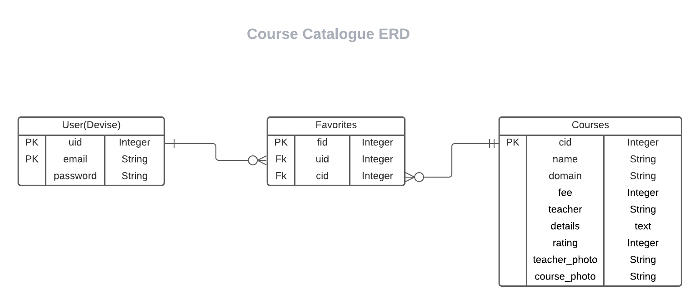

# Courses Rails API

## Project Specification

This is an API made in Rails to serve endpoints for any front end app where a user can browse through the a catalogue and favorite what he likes.

## API Documentation

Check the API documentation file for details on the endpoints.

## ERD



## Built With

- Ruby
- Rails
- Postgres

## Live Demo

[Live Demo Link](https://find-your-houses.herokuapp.com)

## Getting Started

To get a local copy up and running follow these simple example steps.

### Prerequisites

- Ruby: 2.7.2
- Rails: 6.1.3
- Postgres: >=9.5
- Yarn: >= 1.22

### Setup

- Clone this repository
  ```
   git clone git@github.com:akshay-narkar/final-capstone-api.git
  ```
- Open terminal
- Change directory by using
  ```
  cd final-capstone-api
  ```
- Change working branch

  ```
  git checkout final
  ```

- Install gems with:
  ```
  bundle install
  ```
- Setup database with:
  ```
     rails db:create
     rails db:migrate
  ```

### Usage

Start server with:

```
    rails server
```

Run

```
    rails routes
```

in the terminal & test the routes using an app like Postman.

### Run tests

```
    bundle exec rspec
```

### Deployment

From console run the following commands after cloning

- Sign in Heroku.
- Open your terminal.
- Run
  ```
    heroku login.
  ```
- If you get any error, run

  ```
    sudo snap install --classic heroku
  ```

  ```
    heroku create courses-api (or any app name you like)
  ```

  ```
    git push heroku main (pushing from the main branch to main branch on heroku)

    OR

    git push heroku (branch_name):main (pushing from any other branch to main branch on heroku)

  ```

## Authors

👤 **Author1**

- Github: [@akshay-narkar](https://github.com/akshay-narkar)
- Twitter: [Akshay](https://www.twitter.com/akidoit)
- Linkedin: [Akshay Narkar](https://www.linkedin.com/in/akshaynarkar25/)

## 🤝 Contributing

Contributions, issues, and feature requests are welcome!

## Show your support

Give a ⭐️ if you like this project!

## Acknowledgments

- Hat tip to anyone whose code was used
- Inspiration
- etc

## 📝 License

This project is [MIT](./MIT.md) licensed.
